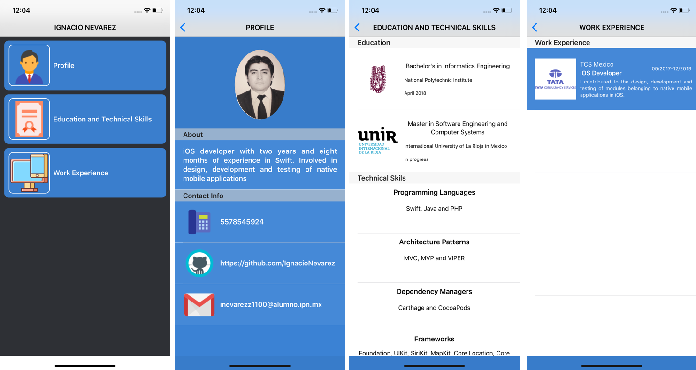

# CVAppProject
iOS mobile application that shows my own Curriculum Vitae (CV)

In order to add the correct JSON content type to the raw link of the gist created in GitHub, I integrated this link with the CDN open source Statically (statically.io) to correctly generate the JSON to consume. The consumed JSON file can be reviewed in this link: 
https://cdn.statically.io/gist/IgnacioNevarez/4259c458cadebe8e4e0ae52402dda46f/raw/5a58b04533bbffc1300f675571ed15edccfdc499/CVPersonalProfile.json

The flow of the app screens can be seen in the following image:

As an additional note, on the screen called "Education and technical skills" it's necessary to scroll to see the full content of the "Frameworks" section.

Regards.
